# LAPORAN PRAKTIKUM

## Praktikum 1: Membangun Layout di Flutter 
### Langkah 1: Buat Project Baru
  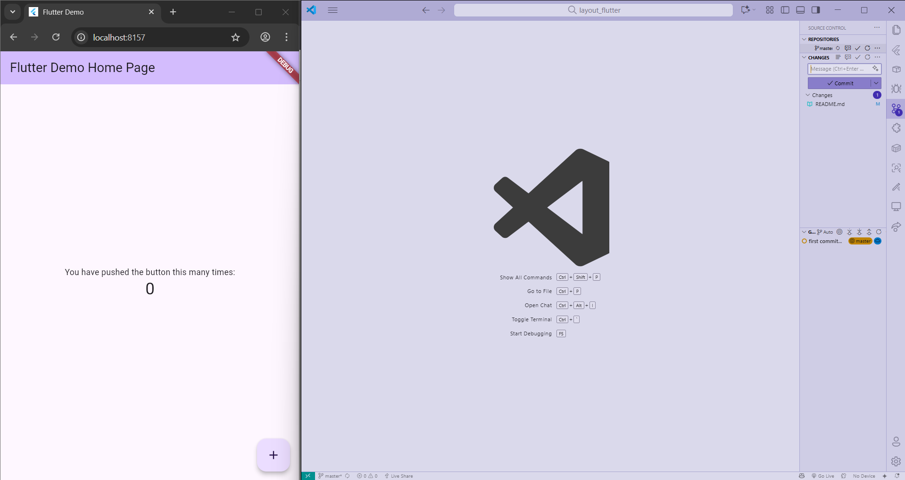
### Langkah 2: Buka & Edit file lib/main.dart
  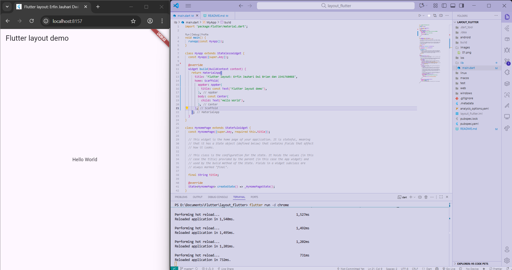
### Langkah 4: Implementasi title row
  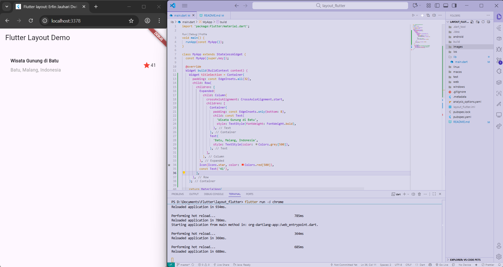

## Praktikum 2: Implementasi button row
### Langkah 1: Buat method Column _buildButtonColumn
  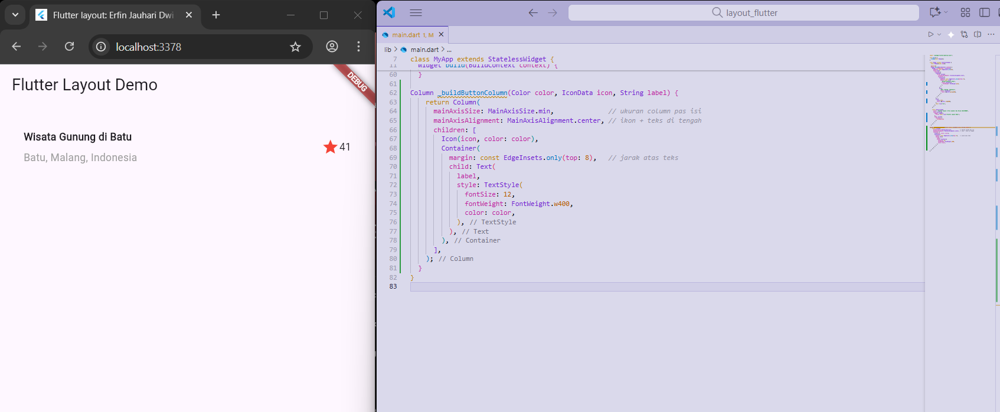
### Langkah 2: Buat widget buttonSection
  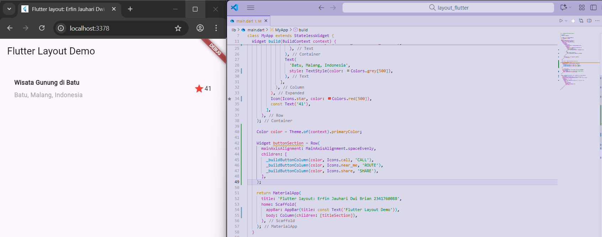
### Langkah 3: Tambah button section ke body
  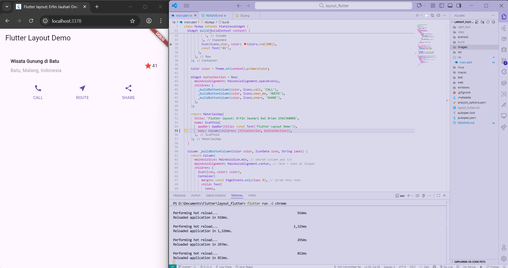

## Praktikum 3: Implementasi text section
### Langkah 1: Buat widget textSection
  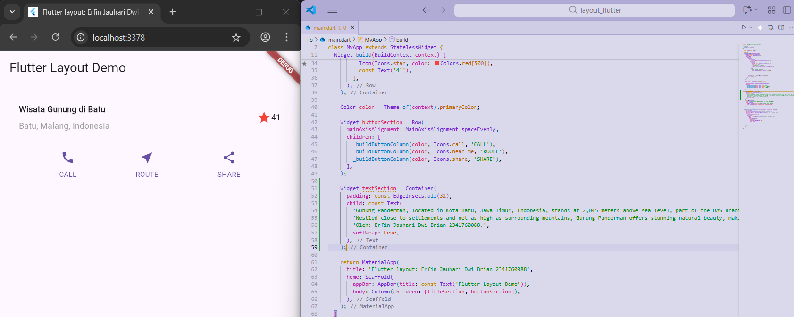
### Langkah 2: Tambah variabel text section ke body
  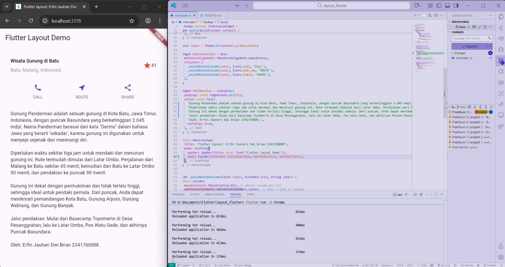

## Praktikum 4: Implementasi image section
### Langkah 1: Siapkan aset gambar
  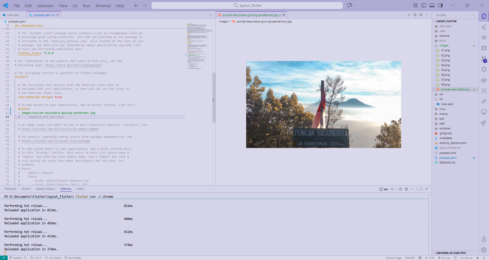
### Langkah 2: Tambahkan gambar ke body
  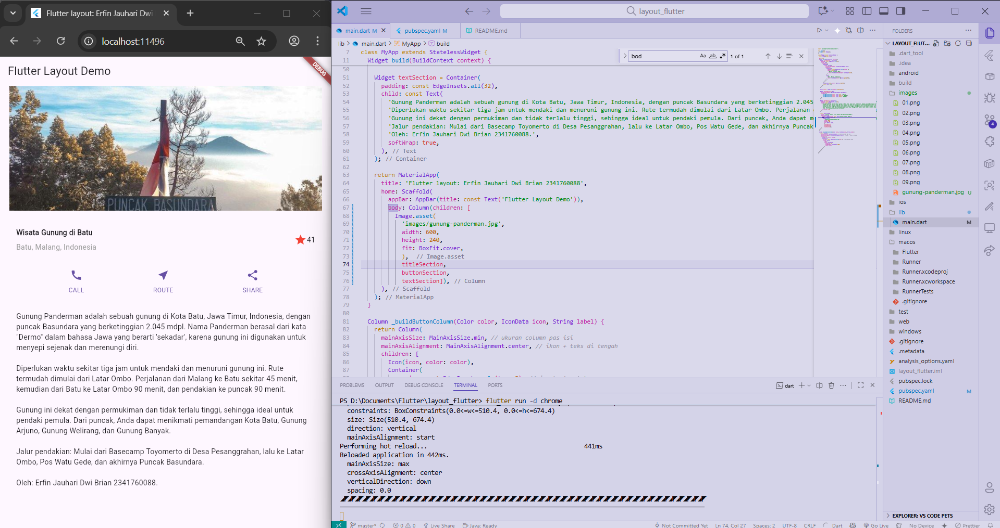
### Langkah 3: Ubah menjadi ListView
  

## Praktikum 5: Membangun Navigasi di Flutter
### Langkah 1: Siapkan project baru
  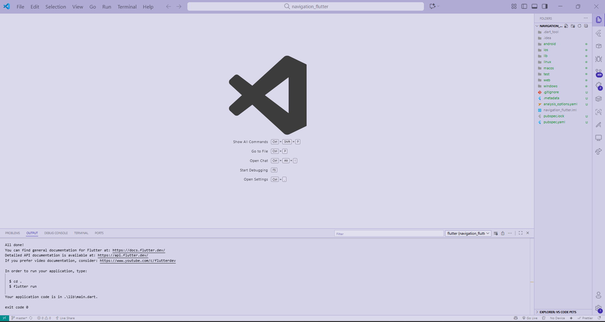
### Langkah 2: Mendefinisikan Route
  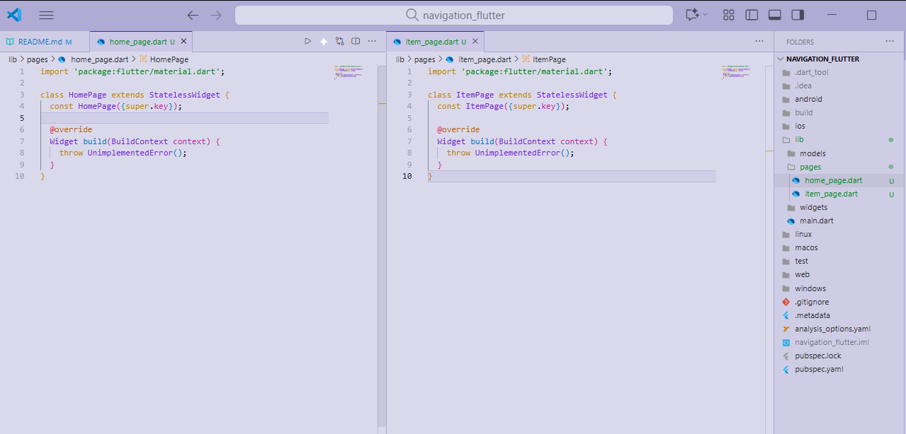
### Langkah 3: Menggunakan Navigator/Mendefinisikan Route 
  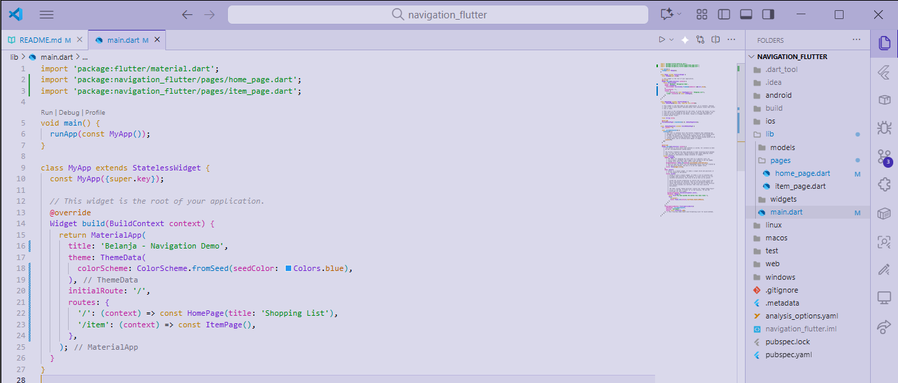
### Langkah 4: Membuat data model
  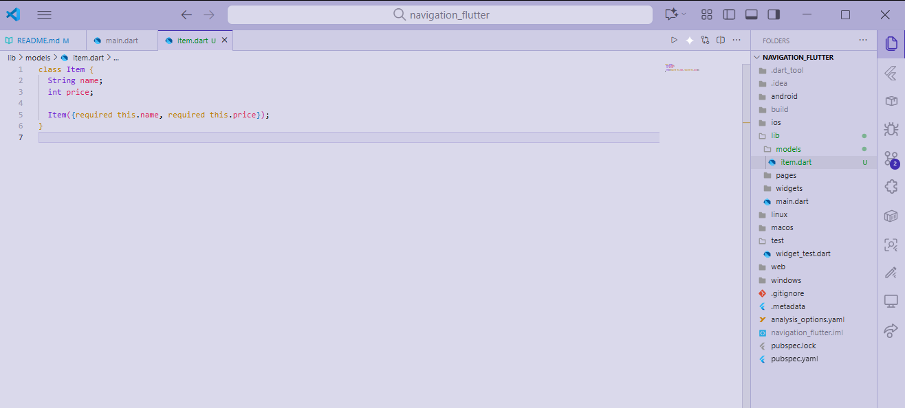
### Langkah 5: Lengkapi kode di class HomePage/Membuat HomePage
  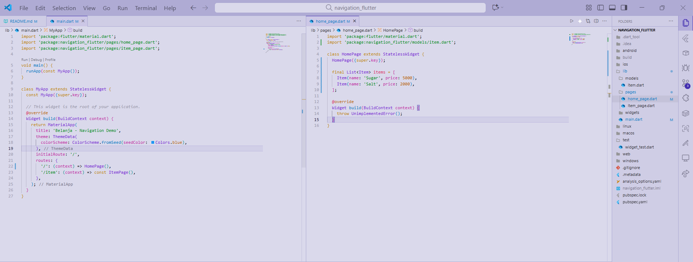